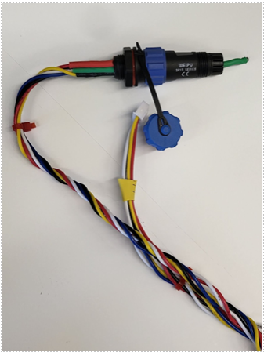
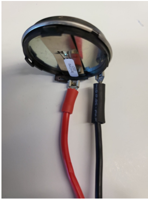
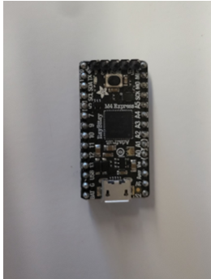
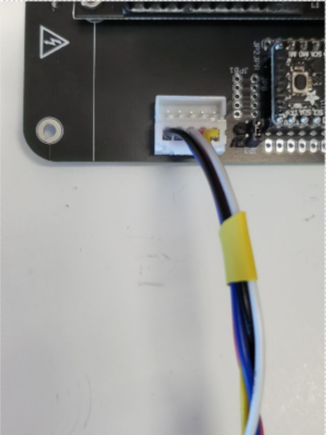
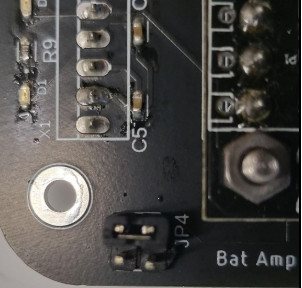
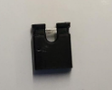

.. _setup-and-assembly:

##################
Setup and Assembly
##################

This section will go over the different components of the sonar system, and the steps which should be followed to 
assemble and set up the the system. All components should be readily available within the lab, or able to be assembled
without too much difficulty.

**********
Components
**********

Microphone 
^^^^^^^^^^

The microphone is what receives the signal (chirp) which is outputted by the transducer and reflected off of a target. 
The microphone is connected to a Weipu connector, which is connected to the hand-twisted wires that connect it to the rest of the system. The microphone should always be oriented towards the target. 

    *The microphone used in the sonar system*

Transducer
^^^^^^^^^^

The transducer takes in a voltage and outputs the signal (chirp). It is connected to the rest of the system by a power and ground wire, connected to the connection points on the transducer itself. 
The transducer should always be oriented towards the target. 

    *The transducer used in the sonar system*

Amplifier
^^^^^^^^^

The amplifier takes in a voltage which is output from the ItsyBitsy and then amplified through the PCB board. It then amplifies the signal further and outputs it through the transducer. 
The green LED on the amplifier’s board indicates that it is on and receiving power. The amplifier datasheet can be found `here <https://www.ti.com/lit/gpn/opa552>`__, and 
the datasheet for the piezo driver upon which the op-amp is soldered can be found `here <https://github.com/BIST-Research/fieldbot/blob/vehicle/docs/PDm200-V9-Datasheet-R5.pdf>`__.

.. figure:: ../img/amp_and_driver.PNG

   *The amplifier and driver used in the sonar system*

ItsyBitsyM4
^^^^^^^^^^^

The ItsyBitsy M4 board is the brains of the sonar system. It controls the sending and receiving of the chirp, the conversion of the received signal into a spectrogram, 
and any other operations. If the LED on the itsybitsy is purple, it likely means that the embedded code has already been uploaded. If it is blue, upload the embedded code through Platformio. 
The pinout for the itsybitsy can be found `here <http://learn.adafruit.com/introducing-adafruit-itsybitsy-m4/pinouts>`__, and the datasheet for the microchip embedded in the itsybitsy can be found `here <https://github.com/BIST-Research/fieldbot/blob/vehicle/docs/ATDAMD51_Datasheet.pdf>`__.

    *The ItsyBitsy M4 used in the sonar system*

PCB Board
^^^^^^^^^

The PCB board is the board on which the sonar setup sits. The board powers all other components, and ensures that the chirp makes it from the itsybitsy through an amplification circuit on the board, 
then to the amplifier, out through the transducer and back in through the microphone. The red LED on the board being lit means that the board is powered. The current version of the board is revision 6. 
Diagrams and schematics can be found in the Fusion drive in the “rev6” folder within the “Sonar Board” folder.

.. figure:: ../img/sonar_board.PNG

   *The PCB board used in the sonar system*

********
Assembly
********

Assembly of the sonar system is fairly straightforward, as all components have been designed to be easily connected to the PCB board.

.. warning::
    Never connect, disconnect, or adjust components while the system is powered on. Always ensure that the power supply is off before making any changes to the system, and whenever the system is not in use.

Amplifier
^^^^^^^^^

The first step is to connect the amplifier to the PCB board. The amplifier has 5 pins on the underside of one end, and 4 pins on the underside
of the other end. Align the pins with their corresponding holes on the PCB board and insert the amplifier into the board. This may take some wiggling,
but should not require excessive force. Some of our PCBs have contact point issues with the amplifier, which can be solved by angling the amplifier 
towards the side of the PCB with the microphone connection. The amplifier should draw roughly 0.15-0.20 A when powered on. If it is drawing less than 
0.05 A, proceed with the aforementioned angling procedure to ensure proper contact, making sure to not move the amplifier while voltage is being applied.
Additionally, the fan on the top of the amplifier should be spinning when powered on. If it is not, this is another sign that the amplifier is not receiving enough power.

Microphone
^^^^^^^^^^

The microphone is connected to the PCB board through a JST connector. There are two open connectors for microphones on the PCB board, labeled Mic1 and Mic2.
If you are only using one microphone, it may be beneficial to comment out the code for graphing whichever microphone is unused, as its graph will be nonsense.
If you are using the microphone(s) with an ear mount, ensure that the metal tip of the microphone is fully inside the ear, and pointing outwards. Shielding the microphone
wires with grounded copper mesh can help to reduce noise in the spectrogram.

   *The microphone connected to the PCB board through a JST connector.*

Transducer
^^^^^^^^^^

The transducer is connected to the PCB board through a screw terminal connected to the wires extending from the back of the transducer. The transducer should be placed inside a 3D printed mount.
The red wire is the power wire and should be connected to the terminal labeled V+ on the PCB board, located at the edge of the board near the amplifier. The black wire is the ground wire 
and should be connected to the terminal labeled G. Ensure that the screws are tightened down on the wires to ensure a good connection. The wire should be able to withstand a gentle tug without coming loose.
It can be beneificial to use a coaxial cable for the transducer connection, as this can help to reduce noise in the spectrogram. Additionally, shielding the transducer wires with grounded copper mesh 
can help to significantly reduce electrical passthrough which may appear in the spectrogram.

TODO: Add image of transducer connection

ItsyBitsy
^^^^^^^^^

Connect the ItsyBitsy M4 to the PCB board through the JPL pins, which are raised above the board. The ItsyBitsy should be oriented such that the USB port is out, with the port on top.
Connect the ItsyBitsy to yout computer with the microUSB cable, and ensure that it is recognized by PlatformIO in VSCode. If it is not recognized, refer to the :ref:`sonar-software` section for troubleshooting steps.
Once connection is established, the embedded code can be uploaded to the ItsyBitsy through PlatformIO. The LED will start blue, flash green once the code is uploaded, and then turn purple.
The embedded code does not need to be re-uploaded unless changes are made to the code itself, so do not be alarmed if the LED is blue during use.

TODO: Add image of itsybitsy connection

JP4 Testing Pins
^^^^^^^^^^^^^^^^

The JP4 pins are located next to the power connection on the PCB board. These pins can be used to test the microphone and transducer by connecting a function generator to them.
When these pins are not being used for testing, a jumper must be placed on them to connect the two pins as detailed in the image below. Failure to do so will result in the system not functioning properly.

   *The JP4 pins connected together with a jumper pin.*

    *A close-up of a jumper pin.*

Power Supply
^^^^^^^^^^^^

The lab has a multitude of DC power supplies which can be used to power the sonar system. The power supply should be set to output 24V at 1A.
The power supply is connected directly to the PCB board through the JST pins located near the ItsyBitsy, through a twisted pair of wires connected to a JST connector.
The red wire is the power wire and should be on the left side of the connector, if you are looking at the connection straight on. 
The black wire is the ground wire and should be on the right side of the connector. The PCB board has a diode which will light up when the board is powered.

.. figure:: ../img/power_connection.PNG

   *The power connection on the PCB board.* 

Target Selection and Positioning
^^^^^^^^^^^^^^^^^^^^^^^^^^^^^^^^

The selection of a target is integral to the outcome of the sonar experiments. As a general rule, the optimal target for our sonar system is a flat, 
rectangular surface (preferably metal) which is placed in front of the system, in the direction that the microphone and transducer are facing. 
The target should be standing upright, as angling the target can cause the chirp to reflect away from the microphone. Non-square targets can be 
very useful for testing the sonar system's ability to detect shapes and angles, but may not reflect as much sound back to the microphone. Therefore,
they are useful for testing the system's capabilities, but not for initial setup and calibration. Targets should be placed at a distance of 0-2 meters away
from the sonar system, although the effectivr range of the system is most likely much greater. If you are positioning a target at a greater distance,
make sure you have adjusted your spectrogram to have a wider time range to give the chirp time to travel to the target and back.

TODO: Add image of potential targets in the lab

Potential Hardware Improvements
^^^^^^^^^^^^^^^^^^^^^^^^^^^^^^^

* Modify the PCB board to physically see when the chirp is being sent, such as a diode which lights up when the chirp enters the amplifier.

* Modify the pre-amplifier circuit on the PCB board to increase amplification of higher frequencies (70-100kHz).

* Improve the amplifier contact points on the PCB board to ensure that the amplifier always makes good contact without angling.

* Identify and eliminate the sources of electrical passthrough which appear in the spectrogram.

