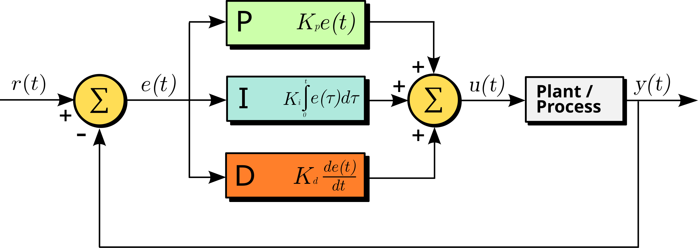

.. _tendon-embedded-software:

##############################
Tendon Embedded Software Guide
##############################

The embedded software for the tendon actuation system performs the dedicated tasks of:

- Controlling the motors that actuate the tendons.
- Managing the serial interface for communication with a host computer.

The software depends on an independently developed Hardware Abstraction Layer (HAL) developed by the BIST team, which can be found `here <https://github.com/BIST-Research/EBatLib>`_.
This project automatically includes the HAL using PlatformIO's library management system, so no further action is required to use it.
To develop the HAL and any other bare-metal funcionality, please refer to the following resources below:

- **Pinout**: https://learn.adafruit.com/adafruit-grand-central/pinouts
- **Chip reference manual**: https://ww1.microchip.com/downloads/aemDocuments/documents/MCU32/ProductDocuments/DataSheets/SAM-D5x-E5x-Family-Data-Sheet-DS60001507.pdf

*************
Motor Control
*************

Motor angle control is achieved through a PID controller that adjusts the motor's position based on angle feedback.
For this controller, we define the **setpoint** to be the desired angle of the motor, and the **process variable** is the current angle measured by the encoder.
The **control signal** is a signed PWM signal with the sign indicating the direction the motor should spin. The control diagram for the PID controller is as follows:

  By Arturo Urquizo - File:PID.svg, CC BY-SA 3.0, https://commons.wikimedia.org/w/index.php?curid=17633925

For those unfamiliar with PID control, it is a closed-loop controller that computes a control signal to minimize the error between the setpoint and the process variable.
The PID controller computes the control signal as a weighted sum of three components: the proportional, integral and derivative components.

- **Proportional**: The proportional component is simply the error multiplied by a gain factor, which determines how aggressively the controller responds to the error.
- **Integral**: The integral component measures the accumulated error over time and allows the controller to correct for any residual error that may persist after the proportional response, also known as steady-state error. The integral component is multiplied by a gain factor that determines how aggressively the controller responds to the accumulated error.
- **Derivative**: The derivative serves to predict the future behavior of the error by taking the derivative (rate of change) of the error. The derivative component is multiplied by a gain factor and can help to dampen the response of the controller, reducing oscillations in the process variable.

For a more visual explanation of PID control, the following video provides a good introduction: https://youtu.be/wkfEZmsQqiA?si=vm7gll-HPGNSaMhs.

The controller parameters and angle input limits can all be tuned during runtime.
The input limits provide a way to constrain the motor setpoint angle to a specific range.
Attempting to set the motor angle outside of the input limits will clamp the setpoint within the minimum and maximum angle.

.. warning::

    It is possible to damage the motors and connected systems if the PID parameters are not set correctly.
    The soft limits impose a maximum and minimum on the angle setpoint, but the PID controller can still reach values that exceed these limits if not tuned properly.

Angle feedback is provided by the motor encoders. The Pololu motor encoders used in this project are incremental encoders based on quadrature signals.
Incremental encoders can only provide relative position information, so all angles are defined relative to the starting position at boot.
However, the system can be calibrated to a known position at startup, allowing for positioning relative to that point.
This is discussed in more detail in the calibration section in :ref:`tendon-scripts`.
The quadrature signals generated by the encoder are a pair of square wave signals that are out of phase, allowing the system to determine both the direction and amount of rotation.
The pulses of the square waves can be used to determine the angle of the motor, while the phase difference between the two signals indicates the direction of rotation.

Note that the motors are also geared and the BIST lab has a supply of motors with different gear ratios and even operating voltages.
Thus, when creating a new motor control object in the code, please be sure to specify the correct gear ratio to ensure accurate angle calculations.
Differences in operating voltage can also affect the motor's performance, however, this can be compensated for by tuning the PID parameters.

********************
Serial Communication
********************

The embedded software also manages a serial interface for communication with a host computer. This allows the host to send commands to the embedded system and receive status updates via the onboard USB port or SPI (WIP).
Currently, the serial interface allows for the following commands:

- **Echo**: Echo back the received message.
- **Set Motor Angle**: Set the desired angle for a specific motor.
- **Get Motor Angle**: Retrieve the current angle of a specific motor.
- **Set PID Parameters**: Set the PID parameters for a specific motor.
- **Zero Encoder**: Reset the encoder position to zero for a specific motor.
- **Set Max Angle**: Set the maximum angle limit for a specific motor.

Communication Protocol
=======================

The serial interface relies on a communication protocol based on a simple request-response model with structured packets.
The request-response model means that every command sent by the host will be followed by a response from the motor controller with requested data or an acknowledgment of the command.
Each motor command is sent as a packet, which is a structured string of bytes containing the following information:

- **Command**: The command to be executed (e.g., set angle, get angle, etc.).
- **Motor ID**: The ID of the motor to which the command applies.
- **Data**: Additional data required for the command (e.g., angle value, PID, etc.).

The packet structure defines the format of messages exchanged between the host and the motor controller.
For this application, the motor controller expects to receive a packet with the following structure:

.. table:: Packet Structure
    :widths: 1 1 1 1 1 1 1 1 1 1

    +--------+--------+-------+--------+--------+--------+--------+--------+--------+--------+
    |Byte 0  |Byte 1  |Byte2  |Byte 3  |Byte 4  |Byte 5  |Byte ...|Byte N  |Byte N+1|Byte N+2|
    +--------+--------+-------+--------+--------+--------+--------+--------+--------+--------+
    |Header           |Length |Motor ID|Opcode  |Params                    |CRC              |
    +--------+--------+-------+--------+--------+--------+--------+--------+--------+--------+
    |0x00    |0xFF    |LEN    |ID      |Opcode  |Param 1 |...     |Param N |CRC1    |CRC2    |
    +--------+--------+-------+--------+--------+--------+--------+--------+--------+--------+

Header
-------
This field acts as a packet delimiter and is used to identify the start of a new packet. 

Length
--------
This field specifies the length of the packet, excluding the header and length. It can simply be computed as the number of parameter bytes + 4.
The length field is a single byte, which allows for packets up to 255 bytes in length.
However the code limits the packet length through a macro, which can be modified (See the API reference for information).

Motor ID
--------
This field specifies the ID of the motor to which the command applies. It is a single byte, which allows for up to 256 motors to be addressed.
The code limits the maximum number of motors through a configurable macro (See the API reference for information).

Opcode
-------
This field specifies the command to be executed, please refer to the Commands Reference section below for a list of available opcodes.

Parameters
-----------
This field contains any additional data required for the command. The number and type of parameters depend on the command being executed, so it can be variable in length.

CRC
---
This field contains a 16-bit checksum to determine if the packet was damaged during transmission.

Response Packet
---------------
The response packet sent back from the motor controller will have the same structure as specified above, but keep in mind that:

- The opcode will always be 0x01
- The motor ID will be the same as the one sent in the request
- The parameters will always (with the exception of the Echo response packet) contain a status code as the first byte followed by any requested data

The following table gives the possible status codes that can be returned by the motor controller:

.. list-table:: Packet Commands
   :widths: 5 25 70
   :header-rows: 1

   * - Status Code
     - Command Status
     - Description
   * - 0x00
     - COMM_SUCCESS
     - The command succecssfully executed
   * - 0x01
     - COMM_FAIL
     - The message could not be received, likely due to some communication error
   * - 0x02
     - COMM_INSTRUCTION_ERROR
     - The received opcode does not correspond to any valid commands
   * - 0x03
     - COMM_CRC_ERROR
     - The received packet failed checksum validation, likely because of data corruption
   * - 0x04
     - COMM_ID_ERROR
     - The received motor ID goes beyond the range of acceptable motor IDs
   * - 0x05
     - COMM_PARAM_ERROR
     - There is either an incorrect number or incorrect format of received parameters

Commands Reference
===================

The following table gives a quick overview of the the available commands that can be sent to the motor controller:

.. list-table:: Packet Commands
   :widths: 5 25 70
   :header-rows: 1

   * - Opcode
     - Command
     - Num Params
   * - 0x00
     - Echo Command
     - Any
   * - 0x01
     - Read Status (Not implemented)
     - 0
   * - 0x02
     - Read Angle
     - 0
   * - 0x03
     - Write Angle
     - 2
   * - 0x04
     - Write PID Parameters
     - 12
   * - 0x06
     - Set Zero Position
     - 0
   * - 0x07
     - Set Max Angle
     - 2
   * - 0x08
     - Disable Motor (Not implemented)
     - 0
   * - 0x09
     - Enable Motor (Not implemented)
     - 0

In this section the functionality, parameters, and responses of each command will be described in detail. 
In discussion of the response packets returned by each command, the ``COMM_FAIL``, ``COMM_CRC_ERROR``, and ``COMM_INSTRUCTION_ERROR`` status codes
will not be discussed because they are not command specific. The first two usually suggest some issue with the physical connection to the microcontroller,
while the last error is obviously unrelated to any of the commands described below.

Echo
------
The Echo command simply sends back the received packet exactly as it was received. This command can accept any arbitrary number of parameters and motor ID.

Input Parameters
^^^^^^^^^^^^^^^^

.. list-table::
   :widths: 5 25
   :header-rows: 1

   * - Param 
     - Description
   * - Param 1
     - User Param 1
   * - Param ...
     - User Param ...
   * - Param N
     - User Param N

Return Parameters
^^^^^^^^^^^^^^^^^
.. list-table::
   :widths: 5 25
   :header-rows: 1

   * - Param 
     - Description
   * - Param 1
     - User Param 1
   * - Param ...
     - User Param ...
   * - Param N
     - User Param N

Status Codes
^^^^^^^^^^^^^
The command does not return any status codes

Read Status
-------------
Not implemented (not sure if needed anymore)

Read Angle
--------------
This command returns the angle of the motor specified by motor ID.

Input Parameters
^^^^^^^^^^^^^^^^

This command does not take any input parameters, but will not return any errors if given any parameters

Return Parameters
^^^^^^^^^^^^^^^^^
The command returns the binary representation of the angle in degrees as a signed 16-bit integer separated into 2 parameters with MSB first.

.. list-table::
   :widths: 5 25
   :header-rows: 1

   * - Param 
     - Description
   * - Param 1
     - Status code
   * - Param 2
     - First 8 bits of angle in degrees as signed int16 (only returned on success)
   * - Param 3
     - Last 8 bits of angle in degrees as signed int16 (only returned on success)

**Example:**

A status packet with the parameters below would indicate a succesful read of a motor with angle 234 (0x00EA = 234) degrees.

.. list-table::
   :widths: 5 25
   :header-rows: 1

   * - Param 
     - Description
   * - Param 1
     - 0x00
   * - Param 2
     - 0x00
   * - Param 3
     - 0xEA

Status Codes
^^^^^^^^^^^^^
.. list-table::
   :widths: 5 25
   :header-rows: 1

   * - Status Flag 
     - Cause
   * - COMM_SUCCESS
     - Successfully read the motor angle
   * - COMM_ID_ERROR
     - The passed in motor ID is not within the range of valid motor IDs

Write Angle
--------------
This command sets the PID angle setpoint of the motor specified by motor ID to the specified angle.

Input Parameters
^^^^^^^^^^^^^^^^

The command accepts the setpoint angle (in degrees) in signed 16-bit binary representation split into 2 parameters with MSB first.

.. list-table::
   :widths: 5 25
   :header-rows: 1

   * - Param 
     - Description
   * - Param 1
     - First 8 bits of angle in degrees as signed int16 
   * - Param 2
     - Last 8 bits of angle in degrees as signed int16

**Example:**

To set the motor to -90 (-90 = 0xFFA6) degrees, set the params to be:

.. list-table::
   :widths: 5 25
   :header-rows: 1

   * - Param 
     - Description
   * - Param 1
     - 0xFF
   * - Param 2
     - 0xA6

Return Parameters
^^^^^^^^^^^^^^^^^

.. list-table::
   :widths: 5 25
   :header-rows: 1

   * - Param 
     - Description
   * - Param 1
     - Status code

Status Codes
^^^^^^^^^^^^^
.. list-table::
   :widths: 5 25
   :header-rows: 1

   * - Status Flag 
     - Cause
   * - COMM_SUCCESS
     - Successfully set the motor angle
   * - COMM_ID_ERROR
     - The passed in motor ID is not within the range of valid motor IDs
   * - COMM_PARAM_ERROR
     - Incorrect number of parameters passed in (must be 2 parameters exactly)

Write PID
--------------
This command sets the PID gains of the motor specified by motor ID to the specified gains. 

Input Parameters
^^^^^^^^^^^^^^^^

The command accepts the PID gains as a set of 3 32-bit (4 byte) floats, resulting in 12 parameters in total. 
Floats must be converted to 32-bit binary representation using the IEEE 754 standard and transmitted to the motor control MSB last (TODO: For consistency with the other commands, we should send MSB first). 

.. list-table::
   :widths: 5 25
   :header-rows: 1

   * - Param 
     - Description
   * - Param 1
     - Last 8 bits of P gain as 32-bit float
   * - Param 2
     - Third 8 bits of P gain as 32-bit float
   * - Param 3
     - Second 8 bits of P gain as 32-bit float
   * - Param 4
     - First 8 bits of P gain as 32-bit float
   * - Param 5
     - Last 8 bits of I gain as 32-bit float
   * - Param 6
     - Third 8 bits of I gain as 32-bit float
   * - Param 7
     - Second 8 bits of I gain as 32-bit float
   * - Param 8
     - First 8 bits of I gain as 32-bit float
   * - Param 9
     - Last 8 bits of D gain as 32-bit float
   * - Param 10
     - Third 8 bits of D gain as 32-bit float
   * - Param 11
     - Second 8 bits of D gain as 32-bit float
   * - Param 12
     - First 8 bits of D gain as 32-bit float

**Example:**

To set the PID gains to 1.0 (0x3F800000), 0.5 (0x3F000000), and 0.25 (0x3E800000), respectively set the params to be:

.. list-table::
   :widths: 5 25
   :header-rows: 1

   * - Param 
     - Description
   * - Param 1
     - 0x00
   * - Param 2
     - 0x00
   * - Param 3
     - 0x80
   * - Param 4
     - 0x3F
   * - Param 5
     - 0x00
   * - Param 6
     - 0x00
   * - Param 7
     - 0x00
   * - Param 8
     - 0x3F
   * - Param 9
     - 0x00
   * - Param 10
     - 0x00
   * - Param 11
     - 0x80
   * - Param 12
     - 0x3E

Return Parameters
^^^^^^^^^^^^^^^^^

.. list-table::
   :widths: 5 25
   :header-rows: 1

   * - Param 
     - Description
   * - Param 1
     - Status code

Status Codes
^^^^^^^^^^^^^
.. list-table::
   :widths: 5 25
   :header-rows: 1

   * - Status Flag 
     - Cause
   * - COMM_SUCCESS
     - Successfully set the PID gains angle
   * - COMM_ID_ERROR
     - The passed in motor ID is not within the range of valid motor IDs
   * - COMM_PARAM_ERROR
     - Incorrect number of parameters passed in (must be 12 parameters exactly)

Set Zero Angle
--------------
This command resets the encounter count, effectively setting the current angle to be the zero angle.

Input Parameters
^^^^^^^^^^^^^^^^

This command does not take any input parameters, but will not return any errors if given any parameters

Return Parameters
^^^^^^^^^^^^^^^^^
.. list-table::
   :widths: 5 25
   :header-rows: 1

   * - Param 
     - Description
   * - Param 1
     - Status code

Status Codes
^^^^^^^^^^^^^
.. list-table::
   :widths: 5 25
   :header-rows: 1

   * - Status Flag 
     - Cause
   * - COMM_SUCCESS
     - Successfully reset the the motor angle
   * - COMM_ID_ERROR
     - The passed in motor ID is not within the range of valid motor IDs

Set Max Angle
--------------
This command sets the passed in angle as the maximum possible setpoint angle.
The maximum range is set symmetrically around the zero angle, so in other words, the minimum range will also
be set to the negative of the maximum. For example, if the maximum is set to 90 degrees, the user may only 
set the motor to angles between -90 and 90, inclusive. Attempting to set the angle to anything beyond this range
will clamp the angle to the limits (e.g. for the -90 to 90 range, attempting to set the motor angle to 100 will set it to 90).

Input Parameters
^^^^^^^^^^^^^^^^

The command accepts the maximum angle (in degrees) in unsigned 16-bit binary representation split into 2 parameters with MSB first. 

.. note::

    The angle being unsigned suggests that the maximum angle should be positive.

.. list-table::
   :widths: 5 25
   :header-rows: 1

   * - Param 
     - Description
   * - Param 1
     - First 8 bits of angle in degrees as unsigned int16 
   * - Param 2
     - Last 8 bits of angle in degrees as unsigned int16

**Example:**

To set the motor angle range to -145 to 145 degrees (145 = 0x0091) degrees, set the params to be:

.. list-table::
   :widths: 5 25
   :header-rows: 1

   * - Param 
     - Description
   * - Param 1
     - 0x00
   * - Param 2
     - 0x91

Return Parameters
^^^^^^^^^^^^^^^^^

.. list-table::
   :widths: 5 25
   :header-rows: 1

   * - Param 
     - Description
   * - Param 1
     - Status code

Status Codes
^^^^^^^^^^^^^
.. list-table::
   :widths: 5 25
   :header-rows: 1

   * - Status Flag 
     - Cause
   * - COMM_SUCCESS
     - Successfully set the motor angle
   * - COMM_ID_ERROR
     - The passed in motor ID is not within the range of valid motor IDs
   * - COMM_PARAM_ERROR
     - Incorrect number of parameters passed in (must be 2 parameters exactly)

Disable Motor
--------------
Not yet implemented, but should disable PID motor control, effectively slacking the motor until reenabled

Enable Motor
--------------
Not yet implemented, but should enable PID motor control, after being enabled

Extending the Communication Protocol
=====================================

The number of implemented opcodes barely take up the range of possible opcodes, so there is more than enough room to accomodate new commands.
Before implementing a command, it is important to understand how we go from a serial packet to a motor action:

1. The microcontroller receives a byte array from the microcontroller
2. The byte array goes to a packet handler which parses the packet to extract the fields from the byte array.
3. Next, CRC validation is performed. If CRC validation fails at this stage, the packet handler skips to sending the response packet with a ``COMM_CRC_ERROR``.
4. The handler then checks and validates the opcode. If the opcode is invalid, the packet handler skips to sending the response packet with a ``COMM_INSTRUCTION_ERROR``.
5. The handler validates motorIDs and parameter numbers. If the motorIDs or parameter numbers are invalid, the packet handler returns a response packet with a ``COMM_ID_ERROR`` or ``COMM_PARAM_ERROR``, respectively.
6. The handler then prepares any data required for the command to execute.
7. Finally, the command is executed and a response packet is built and sent back to the host PC with a ``COMM_SUCCESS`` status and any returned parameters.

Now, the following steps describe how to extend the communication control protocol with new commands:

1. Add the new opcode
    This can simlpy be done by adding a new entry to the ``tendon_opcode_t`` enum in `ml_tendon_comm_protocol.hpp`.
2. Modify the packet structure (if needed!)
    It is possible to modify the packet structure as well by modifying the ``TendonControl_data_packet_s`` struct and all associated enums if necessary, however this is discouraged as it may break some of the validation and parsing functions. Proceed with caution.
3. Creating the command
    In this system, commands are structs that are "derived" from a ``ML_TendonCommandBase`` struct, which contains a function pointer to the "command handler" and the motor ID corresponding to the command.
    The command handler is the function associated with the command. Command structs are "derived" from the ``ML_TendonCommandBase`` struct, meaning that they must have the ``ML_TendonCommandBase`` as the first field.
    
    .. note:: 

        Having a ``ML_TendonCommandBase`` object as the first field allows the command to be cast to and from the ``ML_TendonCommandBase`` data type without any data loss. This is a feature of the C programming language and we leverage this to apply Object Oriented Programming, specifically a form of polymorphism using structs.
        This is useful for applying the Command design pattern (`read more about the command pattern <https://refactoring.guru/design-patterns/command>`_), which this code utilizes.
    
    In addition to a ``ML_TendonCommandBase`` object, the command struct should contain any other required data fields for the command.
    The created struct should be located in `ml_tendon_commands.hpp`.
    For examples, please review the other command structs (they will be named ``ML_[CommandName]Command``).

4. Creating the command handler
    The command handler is the function that performs the desired motor operation. When implementing this function, assume that any packet validation (e.g. CRC, motorID, params) has already been done (we will do it somewhere else).
    It is recommend to follow the naming convention for command handler functions, which is ``ML_[CommandName]_Execute`` and it should be located in ``ml_tendon_commands.cpp``.
    Reveiew the other command handler functions for the function signature and examples.

    The command handler should return a ``CommandReturn_t`` struct. If your command should return any data, this is where it should go.

5. Create a command creation function
    To get from the data packet to a command struct, we utilize the Factory Design pattern (`read more about the factory pattern <https://refactoring.guru/design-patterns/factory-method>`_).
    A factory is already implemented in the form of the ``CommandFactory_CreateCommand`` function, which manages command creation based on the opcode and parameters.
    To "register" your command with the factory function, create a command creation function that returns an instance of your command struct from step 2.
    We recommended following the naming convention for creation functions, which is is ``ML_[CommandName]_Create`` and it should be located in ``ml_tendon_commands.cpp``.
    Review the other command creation functions for the function signature and examples.

    Validation of motor IDs and number of parameters should occur in this function, and the function should then utilize the parameters to populate the command struct with any required data fields.
    Finally, add another switch case to the ``CommandFactory_CreateCommand`` function that calls your creation function.

And you're done!... at least on the embedded side. Clearly, the communication protocol is a lot for a programmer to worry about, 
especially when some members on the BIST team aren't as familiar with C programming or embedded software.
Thus, we've created a more straightforward Python API that handles packet formation so you can use more readable Python code to perform motor commands from the host PC.
The last step of extending the communication protocol would then be to also extend the Python API to include a function for your command.
The process for this is much more straightforward (don't worry it doesn't use any design patterns or obscure language features) and you can read about it at the :ref:`tendon-api-doc` documentation.

***********************
Possible Improvements
***********************

- Implement the incomplete commands
- Utilize FreeRTOS to ensure that motor control deadlines are met
- Port the UART serial logic to SPI
- Packet delimiter isn't actually checked for in the current code, so do that!
- Angle limits to prevent the motor from exceeding the set point range in case of PID control failure
- Move away from polling and used ISRs or DMA for processing UART