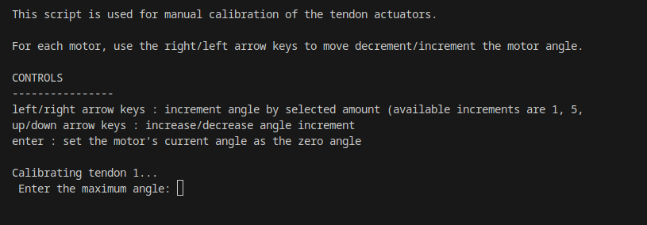

.. _tendon-scripts:

######################
Tendon Scripts & Tools
######################

The BIST team has developed some CLI and GUI tools to perform some typical tasks for tendon control.
This document describes some of those tools.

Tendon Calibration
------------------

This is python script acts as CLI tool for calibrating the motors. It is intended to act primarily as a script for setting the initial motor angles for use in any tendon actuation experiments.

The number of motors is hard-coded in the script, and the script will iterate through each motor starting from 1 up to the last motor.
Before running the script you will need to find the port name associated with the motor controller (e.g. /dev/ttyACM0, COM3, etc.).
The script can then be run by navigating to the ``batbot_bringup`` folder in your terminal and running:
:: 
    
    python tendon_calibration.py [PORT_NAME]

Tendon Time Profiling
---------------------

(TODO: Add a picture)

This script is used for evaluating and visualizing the phases of the communication protocol.
Provides a breakdown of the average time spent during each major phase of the communication process:

- Packet Build Time
- Packet Transmission Time
- Packet Read Time

If communication speed is not sufficient for your application, use this script to find out what steps may need improvement or optimization.
The script can then be run by navigating to the ``batbot_bringup`` folder in your terminal and running:
:: 
    
    python tendon_time_profiling.py

PID Tuning
----------

This script is used for interactive tuning of PID controller for an individual motor. 

(TODO: Add a picture)

This script provides a GUI with a visualization of the controller's step response over time.

.. warning::

    It is possible to damage the motors and connected systems if the PID parameters are not set correctly.
    Some motors in the lab are inverted, so the PID gains may need to be negated.
    Please follow the tuning steps to ensure safety.

Before running the script you will need to find the port name associated with the motor controller (e.g. /dev/ttyACM0, COM3, etc.).
The script can then be run by navigating to the ``batbot_bringup`` folder in your terminal and running:
:: 
    
    python pid_visualizer_GUI.py [PORT_NAME]

How to tune the controller
^^^^^^^^^^^^^^^^^^^^^^^^^^^^

1. Set initial gaings
    Start with 0 gains for all parameters.
2. Tuning P
    Begin incrementing the P gain by a small amount.
    If you observe the motor spinning uncontrollably, it may be that the controller is entering a positive feedback loop, and so you may just need to negate P.
    If you start to observe oscillations in the step response, P is likely too high, so decrease it to eliminate oscillatory behavior.

    .. figure:: ../img/p_tuning.svg

        Example step response for P tuning (image source: https://tlk-energy.de/blog-en/practical-pid-tuning-guide)

3. Tuning I
    Sometimes the controller will not reach the set angle completely. This is steady-state error, and if it is too significant you can try tuning the I gain by increasing
    it until the controller closes the steady-state error in a satisfactory amount of time. If you start to notice oscillations, you likely over-tuned the I gain.
    As with the P gain, keep note of the sign of the I gain.

    .. figure:: ../img/i_tuning.svg

        Example step response for I tuning (image source: https://tlk-energy.de/blog-en/practical-pid-tuning-guide)

4. Tuning D
    Lastly, you may observe an initial overshoot in the step response. If this is undesirable, you can try tuning the D gain.
    This can be done similarly by just increasing the D gain until the overshoot is barely eliminated.
    As with the P and I gain, keep note of the sign of the D gain.

    .. figure:: ../img/d_tuning.svg

        Example step response for D tuning (image source: https://tlk-energy.de/blog-en/practical-pid-tuning-guide)
